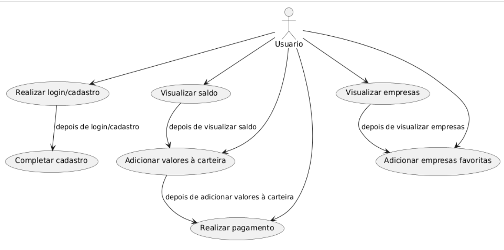
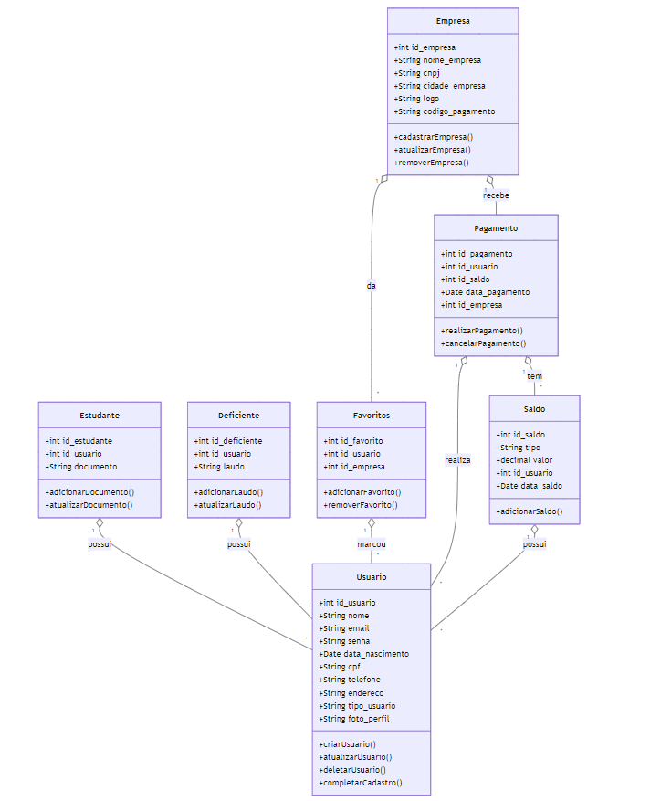
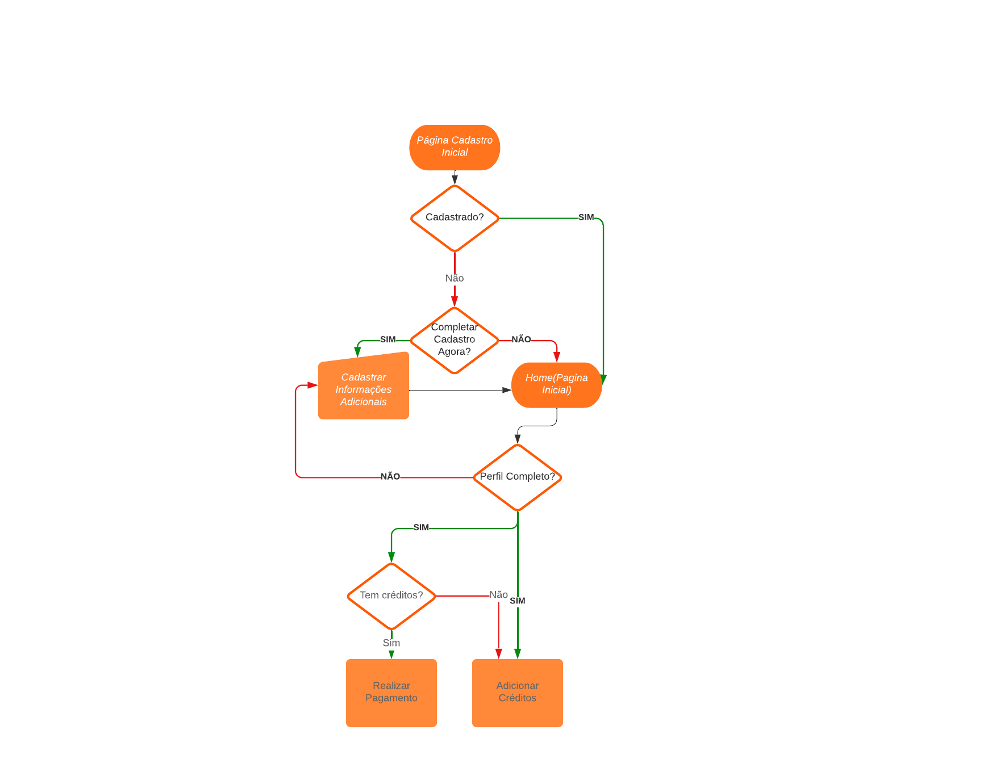

# Projeto-BusOn-Mobile
 

    

 

>  ## _índice:_

- [Introdução](#introdução);
- [Objetivos do Projeto](#objetivos-do-projeto);
- [Funcionalidades](#funcionalidades);
- [Design e Estilos](#design-e-estilos);
- [Estrutura de Programação e Ambiente de Desenvolvimento](#estrutura-de-programação-e-ambiente-de-desenvolvimento);

>  ## _Introdução_

Este projeto tem como objetivo viabilizar uma forma prática e digital de pagamento para a recarga de carteirinhas de transporte público. Atualmente, o processo de recarga ocorre de maneira presencial nos terminais de Limeira, o que pode gerar desconforto e perda de tempo para os usuários, especialmente estudantes e idosos que fazem uso frequente do serviço.

 

> ## _Objetivos do Projeto_

O sistema proposto permitirá que os usuários realizem o pagamento da recarga de suas carteirinhas diretamente pelo aplicativo, eliminando a necessidade de deslocamento até os terminais de recarga. Com isso, busca-se oferecer uma solução acessível e eficiente, proporcionando maior praticidade e conveniência para quem utiliza o transporte público.

 

> ## _Funcionalidades Principais_

- Cadastro e Autenticação: Registro de novos usuários e login seguro para acessar o sistema.
- Visualização de Saldo: Consulta do saldo atual disponível na carteirinha.
- Pagamento de Recarga: Interface simples para adicionar créditos à carteirinha via métodos de pagamento online.
- Gerenciamento de Perfil: Atualização de informações pessoais e documentos, especialmente para estudantes e idosos.
- Favoritos: Opção para salvar empresas de transporte preferidas para fácil acesso.

 

> ### _Manual de Instrução:_

**_Fluxograma de Uso:_**

    

 
Este diagrama destaca as ações possíveis para os usuários:

 # 1. Usuário:

- Realizar login/cadastro: O usuário pode iniciar sessão ou se cadastrar na plataforma. Após o login, é necessário completar o cadastro.
- Completar cadastro: Após realizar o login ou cadastro, o usuário deve preencher informações adicionais obrigatórias.
- Visualizar saldo: O usuário pode acessar seu saldo disponível na carteirinha.
- Adicionar valores à carteira: Após visualizar o saldo, o usuário pode adicionar créditos à sua carteira virtual.
- Realizar pagamento: Depois de adicionar valores à carteira, o usuário pode efetuar pagamentos usando o saldo.
- Visualizar empresas: O usuário pode consultar uma lista de empresas de transporte disponíveis no sistema.
- Adicionar empresas favoritas: Após visualizar as empresas, o usuário pode marcar algumas como favoritas para acesso rápido em futuras consultas.
 

**_Fluxograma de Classe:_**

    

 

Este diagrama de classes representa as principais entidades do sistema de recarga de carteirinhas e suas interações:  

_**Classes principais e seus papéis:**_  

- Usuário: Gerencia os dados do usuário, incluindo cadastro, atualização e exclusão.
- Estudante e Deficiente: Extensões da classe Usuário para estudantes e deficientes, armazenando documentos específicos.
- Empresa: Representa as empresas de transporte, permitindo cadastro e gerenciamento.
- Favoritos: Armazena empresas marcadas como favoritas pelos usuários.
- Saldo: Controla o saldo disponível para recargas.
- Pagamento: Gerencia transações de pagamento realizadas no sistema.

_**Principais métodos:**_ 

- Cadastro e atualização de dados (usuário, empresa, favoritos).
- Adição de saldo e realização de pagamentos.
- Documentação específica para estudantes e deficientes.

 

**_Fluxograma de Fluxo:_**

    

 

Este diagrama de fluxo representa o processo inicial de uso do sistema de recarga de carteirinhas de ônibus, detalhando as etapas desde o cadastro até a realização de pagamentos. Abaixo estão as etapas descritas:

**1. Página de Cadastro Inicial**:
- Se o usuário já estiver cadastrado, ele é redirecionado para a Home (Página Inicial).
- Se não estiver cadastrado, o fluxo segue para verificar se deseja completar o cadastro agora.

**2. Completar Cadastro Agora?**:
- Se o usuário optar por completar o cadastro, ele será direcionado para Cadastrar Informações Adicionais, onde deverá preencher dados complementares.
- Se o usuário não optar por completar o cadastro neste momento, ele segue para a Home (Página Inicial).

**3. Verificação de Perfil Completo**: 
 - Se o perfil estiver completo, o usuário pode prosseguir para verificar seus créditos.
 - Caso contrário, ele será redirecionado novamente para a etapa de Cadastrar Informações Adicionais.

**4. Verificação de Créditos**:
- Se o usuário tiver créditos disponíveis, ele pode seguir para Realizar Pagamento.
- Se não houver créditos, o fluxo segue para Adicionar Créditos, onde o usuário pode recarregar seu saldo.

Este fluxo ilustra a jornada básica do usuário dentro do BusOn, abrangendo desde o registro ou login até as principais ações realizadas dentro do aplicativo.

 

Esses diagramas juntos fornecem uma visão abrangente das funcionalidades e da estrutura do sistema de recarga de carteirinhas de ônibus. A combinação dos diferentes diagramas ilustra claramente as etapas e os componentes principais, desde o processo de autenticação até a gestão de perfis e transações financeiras.

 

> ## _Design e Estilos_
Nesse tópico, irei apresentar todos os Designs de Wireframes de baixa, média e alta fidelidade.

**Design de Baixa Fidelidade:**

    

 

**Design de Média Fidelidade:**

    

 

**Design de Alta Fidelidade:**

    

 

> ## _Estrutura de Programação e Ambiente de Desenvolvimento_
**Framework React**
 
React é uma biblioteca JavaScript amplamente utilizada para a construção de interfaces de usuário (UI) dinâmicas e interativas. Desenvolvido pelo Facebook, ele permite a criação de componentes reutilizáveis, facilitando a manutenção e a escalabilidade de projetos. React oferece uma abordagem eficiente para a atualização da UI com seu Virtual DOM, o que resulta em melhor desempenho e uma experiência de usuário mais fluida.

**Compilador Node.js**
 
Node.js é um ambiente de execução JavaScript no lado do servidor, que permite a construção de aplicações escaláveis e de alta performance. Ele é baseado no motor V8 do Google Chrome e possibilita a criação de servidores web rápidos, suportando um grande número de conexões simultâneas. Node.js é conhecido por sua eficiência em lidar com operações de I/O, tornando-o ideal para aplicações em tempo real.

**Expo**
 
Expo é uma plataforma open-source para criar aplicativos móveis com React Native, facilitando o desenvolvimento para iOS e Android sem a necessidade de configuração complexa. Ele permite testes em tempo real e oferece ferramentas para agilizar o processo de desenvolvimento.

**PostgreSQL**
 
PostgreSQL é um sistema de banco de dados relacional open-source, conhecido por sua robustez, escalabilidade e conformidade com transações ACID. Ele oferece suporte a dados complexos, como JSON, e é altamente extensível, ideal para aplicações de grande porte.

**GitHub**
 
GitHub é uma plataforma de hospedagem de código baseada em Git, que facilita o controle de versão, a colaboração e o gerenciamento de repositórios. É amplamente usado para projetos open-source e integra com ferramentas de CI/CD para otimizar o fluxo de trabalho.

**VS Code**
 
Visual Studio Code é um editor de código leve e gratuito, altamente extensível, que suporta várias linguagens de programação. Ele oferece funcionalidades como autocompletar, depuração integrada e controle de versão, sendo ideal para desenvolvedores de diferentes níveis.

### Temporário
Diagrama de Fluxo de Atividades: https://lucid.app/lucidchart/53afc5e6-b81f-489e-aa27-7c4f236db985/edit?viewport_loc=-102%2C-130%2C3573%2C1823%2C0_0&invitationId=inv_7fc43deb-d43c-4b54-a7cd-810870be098e  

# Sprint 1 - dia 11/11/2024

- Pesquisar sobre o editais sobre as leis de transporte de alunos/deficientes.
- Pesquisar sobre em outros municipios como funciona na parte de descontos.

## Novo Objetivo
- Focar em meio de ser uma empresa de viabilização de pagamentos.

